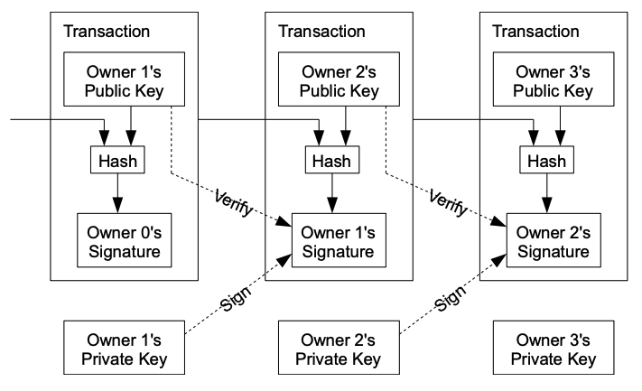
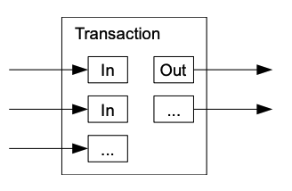

Today's summary is about a [paper](https://bitcoin.org/bitcoin.pdf)  written by Satoshi Nakamoto in 2008.

This paper proposes Bitcoin — a system for electronic transactions without relying on trust.

-----

1. No mechanism exists to make payments over a communications channel (the internet) without a trusted third party (a financial institution).
2. Inherent weaknesses of the trust-based model:
    * It precludes completely **non-reversible transactions** because financial institutions have to mediate disputes.
    * Consequently, it permits **buyers fraud** because of a loss of ability to make non-reversible payments for non­reversible services.
    * It impedes **micropayments** because mediation cost increases transaction costs.
3. A solution: An electronic payment system based on cryptographic proof instead of trust, which allows any two willing parties to transact directly with each other (i.e peer-to-peer) without the need for a trusted third party.

## Solutions to electronic payment system concerns
### a. Forgery
1. An electronic coin can be defined as a chain of digital signatures.
2. Each owner transfers the coin to the next by digitally signing a hash of the previous transaction and the public key of the next owner (recipient) and adding these to the end of the coin. A payee can verify the signatures to verify the chain of ownership.
3. An ID can be attached to each transaction to avoid (intentionally/unintentionally) repeating a transaction.
4. 

### b. Double spending
1. The only way to confirm the absence of a transaction is to be aware of all transactions.
2. A common solution is to introduce a trusted central authority, or mint, that checks every transaction against past transactions.
3. To accomplish this without a trusted party, transactions must be publicly announced, and nodes must come to a consensus on a single history.
4. The payee needs proof that at the time of each transaction, the majority of nodes agreed it was the first received.
5. Specific nodes (miners) accumulate these new transactions into a collection (block).
6. Each block includes the previous block’s hash, forming a chain, with each additional block reinforcing the ones before it.
7. A proof-of-work (PoW) system is employed to compute a block’s nonce such that when hashed (SHA-256) with the rest of the block’s content, the hash begins with a number of zero bits.
8. The average work required is exponential in the number of zero bits required and can be verified by executing a single hash (asymmetry: work is hard, verification is easy).
9. The nonce in the block is simply incremented until a value is found that gives the block's hash the required zero bits.
10. Once the CPU effort has been expended to make it satisfy the proof-of-work, the block cannot be changed without redoing the work.
11. The difficulty of PoW is determined by a moving average targeting an average number of blocks per hour to compensate for increasing hardware speed and varying interest in running nodes over time.
12. The system is secure as long as honest nodes collectively control more CPU power than any cooperating group of attacker nodes.
13. Proof-of-work is essentially one-CPU-one-vote; compared to one-IP-address-one-vote which can be subverted by anyone able to allocate many IPs.
    > If a majority of CPU power is controlled by honest nodes, the honest chain will grow the fastest and outpace any competing chains. To modify a past block, an attacker would have to redo the proof-of-work of the block and all blocks after it and then catch up with and surpass the work of the honest nodes.  

## Network
1. The steps to run the network are as follows: 
	* New transactions are broadcast to all nodes.
	* Each node collects new transactions into a block.
	* Each node works on finding a difficult proof-of-work for its block.
	* When a node finds a proof-of-work, it broadcasts the block to all nodes.
	* Nodes accept the block only if all transactions in it are valid and not already spent.
	* Nodes express their acceptance of the block by working on creating the next block in the chain, using the hash of the accepted block as the previous hash.
2. Tolerance: Nodes are tolerant to any missed block broadcast: they request blocks whenever any new block is received.
3. Conflict resolution: Nodes always consider the longest chain to be the correct one and will keep working on extending it.
4. The network is robust in its unstructured simplicity. Nodes work all at once with little coordination. They do not need to be identified, since messages are not routed to any particular place and only need to be delivered on a best-effort basis.
5. Nodes can leave and rejoin the network at will, accepting the proof-of-work chain as proof of what happened while they were gone.

## Incentive
1. By convention, the first transaction in a block is a special transaction that starts a new coin owned by the creator of the block. This adds an incentive for nodes to support the network and provides a way to initially distribute coins into circulation since there is no central authority to issue them.
2. The incentive can also be funded with transaction fees. If the output value of a transaction is less than its input value, the difference is a transaction fee that is added to the incentive value of the block containing the transaction.
3. Once a predetermined number of coins have entered circulation, the incentive can transition entirely to transaction fees and be completely inflation free.

## Reclaiming Disk Space
1. Transactions are hashed in a Merkle Tree, with only the root included in the block's hash. Old blocks can then be compacted by stubbing off branches of the tree. The interior hashes do not need to be stored.

## Combining and Splitting Value
1. To allow value to be split and combined, transactions contain multiple inputs and outputs.
2. Normally there will be either a single input from a larger previous transaction or multiple inputs combining smaller amounts, and at most two outputs: one for the payment, and one returning the change, if any, back to the sender.

## Privacy
1. The traditional banking model achieves a level of privacy by limiting access to information to the parties involved and the trusted third party.
2. The necessity to announce all transactions publicly precludes this method, but privacy can still be maintained by breaking the flow of information in another place: by keeping public keys anonymous.

## Calculations
1. The paper evaluates two scenarios:
    * An attacker trying to generate an alternate chain faster than the honest chain.
    * How long the recipient of a new transaction needs to wait before being sufficiently certain the sender can't change the transaction.
2. The probability of a slower attacker catching up diminishes exponentially as subsequent blocks are added.